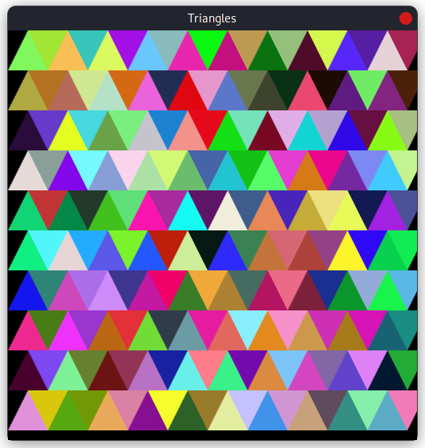

# Triangle tiling
I wanted to experiment with drawing a grid of triangles. Maybe someone will find this useful



## Usage
```
cargo run
```

## License
This project is licensed under [MIT](./LICENSE)
